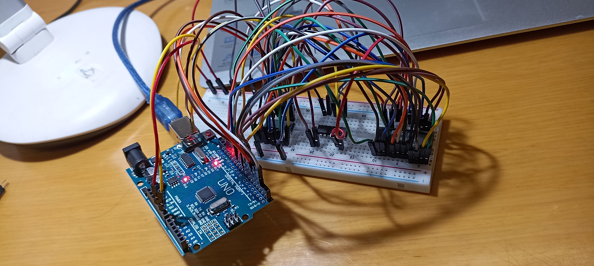

# eeprom_programmer

This repository contains the arduino code to program an EEPROM and also a picture after all the setup is done. The EEPROM used is (2K x 8) XL28C16A from Excel Microelectronics. The 8-bit shift registers used are 74HC595 from ST Microelectronics. This shift register has got an 8-bit storage register unlike 74HC164. 

This is basically the reimplementation of the EEPROM programmer that is shown in Ben Eater's YouTube channel as part of the famous 8-bit computer build - [video link](https://www.youtube.com/watch?v=K88pgWhEb1M&t=807s) . But this version is neat with all the wires and other stuff.

Hence this repo has two versions of the Arduino code - Version from the Ben Eater's eeprom_programmer GitHub repository and the version that I wrote (basically understanding, checking with the original code, debugging and rewriting) which is very much depreciated ones in terms of comments and other things.

Along with the code, this also have the data sheets for both the ICs. 

